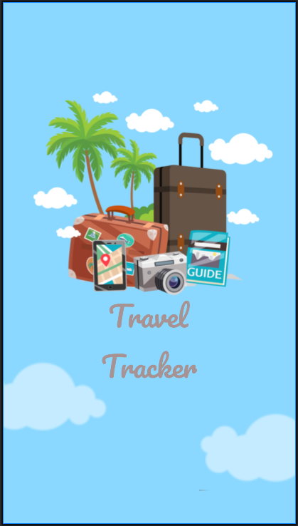
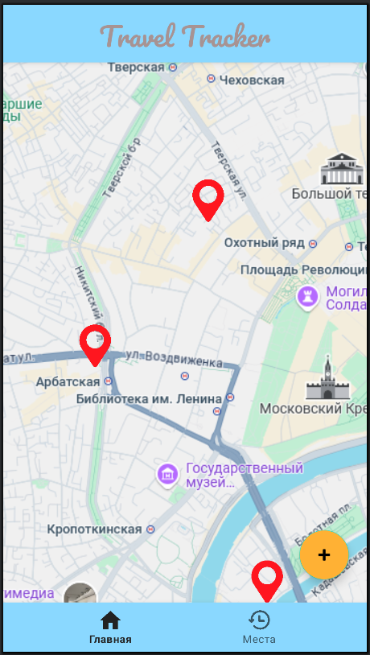
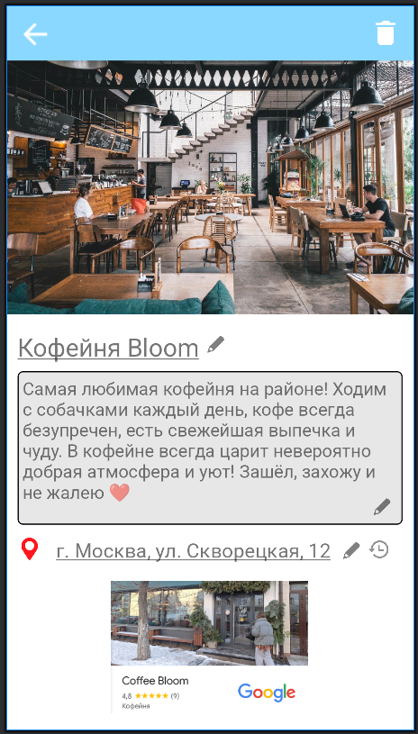
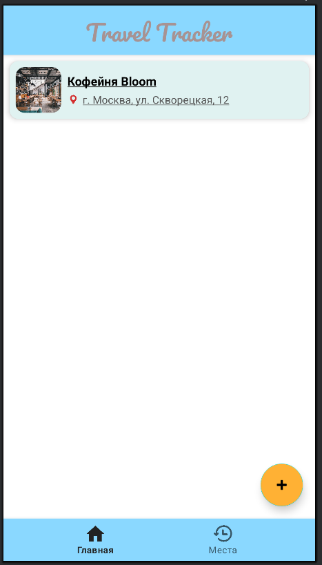

# Android-приложение Travel Tracker

## Экран загрузки (activity_load.xml)

``` XML
<?xml version="1.0" encoding="utf-8"?>
<androidx.constraintlayout.widget.ConstraintLayout xmlns:android="http://schemas.android.com/apk/res/android"
    xmlns:app="http://schemas.android.com/apk/res-auto"
    xmlns:tools="http://schemas.android.com/tools"
    android:layout_width="match_parent"
    android:layout_height="match_parent"
    android:background="@color/light_blue">

    <ImageView
        android:id="@+id/imageView"
        android:layout_width="wrap_content"
        android:layout_height="wrap_content"
        android:layout_marginTop="88dp"
        android:contentDescription="@string/app_logo_description"
        app:layout_constraintEnd_toEndOf="parent"
        app:layout_constraintHorizontal_bias="1.0"
        app:layout_constraintStart_toStartOf="parent"
        app:layout_constraintTop_toTopOf="parent"
        app:srcCompat="@drawable/icon" />

    <TextView
        android:id="@+id/textView"
        android:layout_width="141dp"
        android:layout_height="158dp"
        android:fontFamily="@font/pacifico_regular"
        android:gravity="center"
        android:text="@string/app_name_load_screen"
        android:textColor="@color/light_pink"
        android:textSize="40sp"
        app:layout_constraintBottom_toBottomOf="parent"
        app:layout_constraintEnd_toEndOf="parent"
        app:layout_constraintStart_toStartOf="parent"
        app:layout_constraintTop_toTopOf="parent"
        app:layout_constraintVertical_bias="0.685" />

    <ImageView
        android:id="@+id/imageView2"
        android:layout_width="211dp"
        android:layout_height="150dp"
        android:layout_marginEnd="252dp"
        android:layout_marginBottom="100dp"
        android:contentDescription="@string/load_screen_cloud"
        app:layout_constraintBottom_toBottomOf="parent"
        app:layout_constraintEnd_toEndOf="parent"
        app:srcCompat="@drawable/cloud"
        android:alpha="0.5"
        />

    <ImageView
        android:id="@+id/imageView3"
        android:layout_width="211dp"
        android:layout_height="150dp"
        android:layout_marginStart="276dp"
        android:layout_marginBottom="28dp"
        android:alpha="0.5"
        android:contentDescription="@string/load_screen_cloud"
        app:layout_constraintBottom_toBottomOf="parent"
        app:layout_constraintStart_toStartOf="parent"
        app:srcCompat="@drawable/cloud" />
</androidx.constraintlayout.widget.ConstraintLayout>
```



## Главный экран (activity_main.xml)

``` XML
<?xml version="1.0" encoding="utf-8"?>
<androidx.coordinatorlayout.widget.CoordinatorLayout xmlns:android="http://schemas.android.com/apk/res/android"
    xmlns:tools="http://schemas.android.com/tools"
    xmlns:app="http://schemas.android.com/apk/res-auto"


    android:layout_width="match_parent"
    android:layout_height="match_parent">

    <androidx.core.widget.NestedScrollView
        android:layout_width="match_parent"
        android:layout_height="match_parent"


        app:layout_behavior="com.google.android.material.appbar.AppBarLayout$ScrollingViewBehavior">

        <androidx.constraintlayout.widget.ConstraintLayout
            android:layout_width="match_parent"
            android:layout_height="match_parent">

            <ImageView
                android:id="@+id/map"
                android:layout_width="535dp"
                android:layout_height="950dp"
                android:contentDescription="@string/map"
                app:layout_constraintBottom_toBottomOf="parent"
                app:layout_constraintEnd_toEndOf="parent"
                app:layout_constraintStart_toStartOf="parent"
                app:layout_constraintTop_toTopOf="parent"
                app:layout_constraintVertical_bias="0.675"
                app:srcCompat="@drawable/map" />

            <Toolbar
                android:id="@+id/toolbar"
                android:layout_width="match_parent"
                android:layout_height="65dp"
                android:background="@color/light_blue"
                android:elevation="4dp"
                app:layout_constraintStart_toStartOf="parent"
                app:layout_constraintTop_toTopOf="parent">

                <TextView
                    android:id="@+id/textView"
                    android:layout_width="wrap_content"
                    android:layout_height="wrap_content"
                    android:layout_gravity="center"
                    android:fontFamily="@font/pacifico_regular"
                    android:text="@string/app_name_main_screen"
                    android:textColor="@color/light_pink"
                    android:textSize="30sp" />

            </Toolbar>

            <ImageView
                android:id="@+id/mapPin1"
                android:layout_width="66dp"
                android:layout_height="67dp"
                android:contentDescription="@string/map_pin_1"
                app:layout_constraintBottom_toBottomOf="parent"
                app:layout_constraintEnd_toEndOf="parent"
                app:layout_constraintHorizontal_bias="0.205"
                app:layout_constraintStart_toStartOf="parent"
                app:layout_constraintTop_toTopOf="parent"
                app:layout_constraintVertical_bias="0.399"
                app:srcCompat="@drawable/mappin" />

            <ImageView
                android:id="@+id/mapPin2"
                android:layout_width="66dp"
                android:layout_height="67dp"
                android:contentDescription="@string/map_pin_2"
                app:layout_constraintBottom_toBottomOf="parent"
                app:layout_constraintEnd_toEndOf="parent"
                app:layout_constraintHorizontal_bias="0.576"
                app:layout_constraintStart_toStartOf="parent"
                app:layout_constraintTop_toTopOf="parent"
                app:layout_constraintVertical_bias="0.213"
                app:srcCompat="@drawable/mappin" />

            <ImageView
                android:id="@+id/mapPin3"
                android:layout_width="66dp"
                android:layout_height="67dp"
                android:contentDescription="@string/map_pin_3"
                app:layout_constraintBottom_toBottomOf="parent"
                app:layout_constraintEnd_toEndOf="parent"
                app:layout_constraintHorizontal_bias="0.768"
                app:layout_constraintStart_toStartOf="parent"
                app:layout_constraintTop_toTopOf="parent"
                app:layout_constraintVertical_bias="0.701"
                app:srcCompat="@drawable/mappin" />

            <com.google.android.material.floatingactionbutton.FloatingActionButton
                android:id="@+id/floatingActionButton2"
                android:layout_width="wrap_content"
                android:layout_height="wrap_content"
                android:layout_marginEnd="20dp"
                android:layout_marginBottom="300dp"
                android:clickable="true"
                android:contentDescription="@string/add_place_button"
                android:focusable="true"
                app:layout_constraintBottom_toBottomOf="@+id/map"
                app:layout_constraintEnd_toEndOf="parent"
                app:srcCompat="@android:drawable/ic_input_add"
                android:backgroundTint="@color/orange"/>

        </androidx.constraintlayout.widget.ConstraintLayout>

    </androidx.core.widget.NestedScrollView>

    <com.google.android.material.bottomnavigation.BottomNavigationView
        android:id="@+id/bottom_navigation"
        android:layout_width="match_parent"
        android:layout_height="wrap_content"
        android:layout_gravity="bottom"
        android:background="@color/light_blue"
        android:elevation="5dp"
        app:menu="@menu/bottom_nav_menu"
        />


</androidx.coordinatorlayout.widget.CoordinatorLayout>
```



## Просмотр места (activity_place.xml)

``` XML
<?xml version="1.0" encoding="utf-8"?>
<androidx.constraintlayout.widget.ConstraintLayout xmlns:android="http://schemas.android.com/apk/res/android"
    xmlns:app="http://schemas.android.com/apk/res-auto"
    xmlns:tools="http://schemas.android.com/tools"
    android:layout_width="match_parent"
    android:layout_height="match_parent">

    <ImageView
        android:id="@+id/imageView4"
        android:layout_width="421dp"
        android:layout_height="312dp"
        android:contentDescription="@string/photo_of_place"
        app:layout_constraintEnd_toEndOf="parent"
        app:layout_constraintStart_toStartOf="parent"
        app:layout_constraintTop_toTopOf="parent"
        app:srcCompat="@drawable/place_photo" />

    <androidx.appcompat.widget.Toolbar
        android:id="@+id/toolbar"
        android:layout_width="match_parent"
        android:layout_height="wrap_content"
        android:background="@color/light_blue"
        android:elevation="5dp"
        android:theme="@style/ThemeOverlay.AppCompat.Dark.ActionBar"
        app:layout_constraintStart_toStartOf="parent"
        app:layout_constraintTop_toTopOf="parent"
        app:menu="@menu/toolbar_menu_show"
        app:navigationIcon="@drawable/ic_arrow_back"
        app:popupTheme="@style/ThemeOverlay.AppCompat.Light" />

    <TextView
        android:id="@+id/textView2"
        android:layout_width="wrap_content"
        android:layout_height="wrap_content"
        android:layout_marginTop="16dp"
        android:fontFamily="@font/roboto"
        android:text='@string/place_name'
        android:textSize="25sp"
        app:layout_constraintEnd_toEndOf="parent"
        app:layout_constraintHorizontal_bias="0.051"
        app:layout_constraintStart_toStartOf="parent"
        app:layout_constraintTop_toBottomOf="@+id/imageView4" />

    <ImageView
        android:id="@+id/imageView5"
        android:layout_width="17dp"
        android:layout_height="20dp"
        android:layout_marginStart="8dp"
        android:layout_marginTop="20dp"
        android:contentDescription="@string/place_name_edit_icon"
        app:layout_constraintStart_toEndOf="@+id/textView2"
        app:layout_constraintTop_toBottomOf="@+id/imageView4"
        app:srcCompat="@drawable/ic_edit"
        android:alpha=".5"/>

    <TextView
        android:id="@+id/textView3"
        android:layout_width="389dp"
        android:layout_height="155dp"
        android:layout_marginTop="8dp"
        android:background="@drawable/round_corner"
        android:fontFamily="@font/roboto"
        android:padding="5dp"
        android:text="@string/place_description"
        android:textSize="18sp"
        app:layout_constraintEnd_toEndOf="parent"
        app:layout_constraintStart_toStartOf="parent"
        app:layout_constraintTop_toBottomOf="@+id/textView2" />

    <ImageView
        android:id="@+id/imageView6"
        android:layout_width="17dp"
        android:layout_height="20dp"
        android:layout_marginEnd="12dp"
        android:layout_marginBottom="8dp"
        android:alpha=".5"
        android:contentDescription="@string/place_name_edit_icon"
        app:layout_constraintBottom_toBottomOf="@+id/textView3"
        app:layout_constraintEnd_toEndOf="@+id/textView3"
        app:srcCompat="@drawable/ic_edit" />

    <ImageView
        android:id="@+id/imageView8"
        android:layout_width="17dp"
        android:layout_height="20dp"
        android:layout_marginStart="12dp"
        android:layout_marginTop="16dp"
        android:alpha=".5"
        android:contentDescription="@string/place_name_edit_icon"
        app:layout_constraintStart_toEndOf="@+id/textView4"
        app:layout_constraintTop_toBottomOf="@+id/textView3"
        app:srcCompat="@drawable/ic_edit" />

    <ImageView
        android:id="@+id/imageView7"
        android:layout_width="31dp"
        android:layout_height="33dp"
        android:layout_marginStart="8dp"
        android:layout_marginTop="8dp"
        android:contentDescription="@string/place_address_pin"
        app:layout_constraintStart_toStartOf="parent"
        app:layout_constraintTop_toBottomOf="@+id/textView3"
        app:srcCompat="@drawable/mappin" />

    <TextView
        android:id="@+id/textView4"
        android:layout_width="wrap_content"
        android:layout_height="wrap_content"
        android:layout_marginTop="12dp"
        android:fontFamily="@font/roboto"
        android:text='@string/place_address'
        android:textSize="20sp"
        app:layout_constraintEnd_toEndOf="parent"
        app:layout_constraintHorizontal_bias="0.375"
        app:layout_constraintStart_toStartOf="parent"
        app:layout_constraintTop_toBottomOf="@+id/textView3" />

    <ImageView
        android:id="@+id/imageView9"
        android:layout_width="22dp"
        android:layout_height="18dp"
        android:layout_marginStart="8dp"
        android:layout_marginTop="16dp"
        android:contentDescription="@string/refresh_address_icon"
        app:layout_constraintStart_toEndOf="@+id/imageView8"
        app:layout_constraintTop_toBottomOf="@+id/textView3"
        app:srcCompat="@drawable/ic_places"
        android:alpha=".5"/>

    <ImageView
        android:id="@+id/imageView10"
        android:layout_width="212dp"
        android:layout_height="134dp"
        android:layout_marginBottom="16dp"
        android:contentDescription="@string/google_widget"
        app:layout_constraintBottom_toBottomOf="parent"
        app:layout_constraintEnd_toEndOf="parent"
        app:layout_constraintHorizontal_bias="0.497"
        app:layout_constraintStart_toStartOf="parent"
        app:srcCompat="@drawable/google_widget"/>

</androidx.constraintlayout.widget.ConstraintLayout>
```



## Создание места (activity_create.xml)

``` XML
<?xml version="1.0" encoding="utf-8"?>
<androidx.constraintlayout.widget.ConstraintLayout xmlns:android="http://schemas.android.com/apk/res/android"
    xmlns:tools="http://schemas.android.com/tools"
    android:layout_width="match_parent"
    android:layout_height="match_parent"
    xmlns:app="http://schemas.android.com/apk/res-auto">

    <androidx.appcompat.widget.Toolbar
        android:id="@+id/toolbar"
        android:layout_width="match_parent"
        android:layout_height="wrap_content"
        android:background="@color/light_blue"
        android:elevation="5dp"
        android:theme="@style/ThemeOverlay.AppCompat.Dark.ActionBar"
        app:layout_constraintStart_toStartOf="parent"
        app:layout_constraintTop_toTopOf="parent"
        app:menu="@menu/toolbar_menu_create"
        app:navigationIcon="@drawable/ic_arrow_back"
        app:popupTheme="@style/ThemeOverlay.AppCompat.Light" />

    <ImageView
        android:id="@+id/imageView11"
        android:layout_width="408dp"
        android:layout_height="291dp"
        android:contentDescription="@string/no_image_place"
        app:layout_constraintEnd_toEndOf="parent"
        app:layout_constraintStart_toStartOf="parent"
        app:layout_constraintTop_toBottomOf="@+id/toolbar"
        app:srcCompat="@drawable/no_image" />

    <TextView
        android:id="@+id/textView6"
        android:layout_width="wrap_content"
        android:layout_height="wrap_content"
        android:layout_marginTop="16dp"
        android:fontFamily="@font/roboto"
        android:text='@string/new_place_name'
        android:textSize="25sp"
        app:layout_constraintEnd_toEndOf="parent"
        app:layout_constraintHorizontal_bias="0.051"
        app:layout_constraintStart_toStartOf="parent"
        app:layout_constraintTop_toBottomOf="@+id/imageView11" />

    <ImageView
        android:id="@+id/imageView13"
        android:layout_width="17dp"
        android:layout_height="20dp"
        android:layout_marginStart="8dp"
        android:layout_marginTop="23dp"
        android:alpha=".5"
        android:contentDescription="@string/place_name_edit_icon"
        app:layout_constraintStart_toEndOf="@+id/textView6"
        app:layout_constraintTop_toBottomOf="@+id/imageView11"
        app:srcCompat="@drawable/ic_edit" />

    <TextView
        android:id="@+id/textView7"
        android:layout_width="389dp"
        android:layout_height="155dp"
        android:layout_marginTop="8dp"
        android:background="@drawable/round_corner"
        android:fontFamily="@font/roboto"
        android:padding="5dp"
        android:text="@string/new_place_description"
        android:textSize="18sp"
        app:layout_constraintEnd_toEndOf="parent"
        app:layout_constraintStart_toStartOf="parent"
        app:layout_constraintTop_toBottomOf="@+id/textView6" />

    <ImageView
        android:id="@+id/imageView14"
        android:layout_width="17dp"
        android:layout_height="20dp"
        android:layout_marginEnd="12dp"
        android:layout_marginBottom="8dp"
        android:alpha=".5"
        android:contentDescription="@string/place_name_edit_icon"
        app:layout_constraintBottom_toBottomOf="@+id/textView7"
        app:layout_constraintEnd_toEndOf="@+id/textView7"
        app:srcCompat="@drawable/ic_edit" />

    <ImageView
        android:id="@+id/imageView18"
        android:layout_width="31dp"
        android:layout_height="33dp"
        android:layout_marginStart="8dp"
        android:layout_marginTop="8dp"
        android:contentDescription="@string/place_address_pin"
        app:layout_constraintStart_toStartOf="parent"
        app:layout_constraintTop_toBottomOf="@+id/textView7"
        app:srcCompat="@drawable/mappin" />

    <TextView
        android:id="@+id/textView8"
        android:layout_width="wrap_content"
        android:layout_height="wrap_content"
        android:layout_marginTop="12dp"
        android:fontFamily="@font/roboto"
        android:text='@string/new_place_address'
        android:textSize="20sp"
        app:layout_constraintEnd_toEndOf="parent"
        app:layout_constraintHorizontal_bias="0.155"
        app:layout_constraintStart_toStartOf="parent"
        app:layout_constraintTop_toBottomOf="@+id/textView7" />

    <ImageView
        android:id="@+id/imageView19"
        android:layout_width="17dp"
        android:layout_height="20dp"
        android:layout_marginStart="12dp"
        android:layout_marginTop="16dp"
        android:alpha=".5"
        android:contentDescription="@string/place_name_edit_icon"
        app:layout_constraintStart_toEndOf="@+id/textView8"
        app:layout_constraintTop_toBottomOf="@+id/textView7"
        app:srcCompat="@drawable/ic_edit" />

    <ImageView
        android:id="@+id/imageView20"
        android:layout_width="22dp"
        android:layout_height="18dp"
        android:layout_marginStart="8dp"
        android:layout_marginTop="16dp"
        android:alpha=".5"
        android:contentDescription="@string/refresh_address_icon"
        app:layout_constraintStart_toEndOf="@+id/imageView19"
        app:layout_constraintTop_toBottomOf="@+id/textView7"
        app:srcCompat="@drawable/ic_places" />

    <ImageView
        android:id="@+id/imageView10"
        android:layout_width="171dp"
        android:layout_height="115dp"
        android:layout_marginBottom="12dp"
        android:contentDescription="@string/google_widget"
        app:layout_constraintBottom_toBottomOf="parent"
        app:layout_constraintEnd_toEndOf="parent"
        app:layout_constraintStart_toStartOf="parent"
        app:srcCompat="@drawable/no_widget" />


</androidx.constraintlayout.widget.ConstraintLayout>
```


## Просмотр списка мест (activity_list.xml)

``` XML
<?xml version="1.0" encoding="utf-8"?>
<androidx.constraintlayout.widget.ConstraintLayout xmlns:android="http://schemas.android.com/apk/res/android"
    xmlns:tools="http://schemas.android.com/tools"
    android:layout_width="match_parent"
    android:layout_height="match_parent"
    xmlns:app="http://schemas.android.com/apk/res-auto">

    <Toolbar
        android:id="@+id/toolbar"
        android:layout_width="match_parent"
        android:layout_height="65dp"
        android:background="@color/light_blue"
        android:elevation="4dp"
        app:layout_constraintStart_toStartOf="parent"
        app:layout_constraintTop_toTopOf="parent">

        <TextView
            android:id="@+id/textView"
            android:layout_width="wrap_content"
            android:layout_height="wrap_content"
            android:layout_gravity="center"
            android:fontFamily="@font/pacifico_regular"
            android:text="@string/app_name_main_screen"
            android:textColor="@color/light_pink"
            android:textSize="30sp" />

    </Toolbar>

    <LinearLayout
        android:layout_width="match_parent"
        android:layout_height="wrap_content"
        android:layout_margin="8dp"
        android:background="@drawable/bg_card"
        android:elevation="4dp"
        android:gravity="center_vertical"
        android:orientation="horizontal"
        android:padding="8dp"
        app:layout_constraintEnd_toEndOf="parent"
        app:layout_constraintHorizontal_bias="0.0"
        app:layout_constraintStart_toStartOf="parent"
        app:layout_constraintTop_toBottomOf="@+id/toolbar">

        <ImageView
            android:id="@+id/coffeeImage"
            android:layout_width="60dp"
            android:layout_height="60dp"
            android:layout_marginEnd="8dp"
            android:background="@drawable/rounded_image"
            android:clipToOutline="true"
            android:contentDescription="@string/card_place_photo"
            android:scaleType="centerCrop"
            android:src="@drawable/place_photo" />

        <LinearLayout
            android:layout_width="0dp"
            android:layout_height="wrap_content"
            android:layout_weight="1"
            android:orientation="vertical">

            <TextView
                android:id="@+id/coffeeTitle"
                android:layout_width="wrap_content"
                android:layout_height="wrap_content"
                android:text="@string/place_name"
                android:textColor="#000000"
                android:textSize="16sp"
                android:textStyle="bold" />

            <LinearLayout
                android:layout_width="wrap_content"
                android:layout_height="wrap_content"
                android:layout_marginTop="4dp"
                android:gravity="center_vertical"
                android:orientation="horizontal">

                <ImageView
                    android:layout_width="16dp"
                    android:layout_height="16dp"
                    android:layout_marginEnd="4dp"
                    android:src="@drawable/mappin"
                    app:tint="#D32F2F" />

                <TextView
                    android:id="@+id/coffeeAddress"
                    android:layout_width="wrap_content"
                    android:layout_height="wrap_content"
                    android:text="@string/place_address"
                    android:textColor="#555555"
                    android:textSize="14sp" />
            </LinearLayout>
        </LinearLayout>
    </LinearLayout>

    <com.google.android.material.floatingactionbutton.FloatingActionButton
        android:id="@+id/floatingActionButton2"
        android:layout_width="wrap_content"
        android:layout_height="wrap_content"
        android:layout_marginEnd="16dp"
        android:layout_marginBottom="16dp"
        android:backgroundTint="@color/orange"
        android:clickable="true"
        android:contentDescription="@string/add_place_button"
        android:focusable="true"
        app:layout_constraintBottom_toTopOf="@+id/bottom_navigation"
        app:layout_constraintEnd_toEndOf="parent"
        app:srcCompat="@android:drawable/ic_input_add" />

    <com.google.android.material.bottomnavigation.BottomNavigationView
        android:id="@+id/bottom_navigation"
        android:layout_width="match_parent"
        android:layout_height="wrap_content"
        android:layout_gravity="bottom"
        android:background="@color/light_blue"
        android:elevation="5dp"
        app:menu="@menu/bottom_nav_menu"
        app:layout_constraintBottom_toBottomOf="parent"
        />

</androidx.constraintlayout.widget.ConstraintLayout>
```


